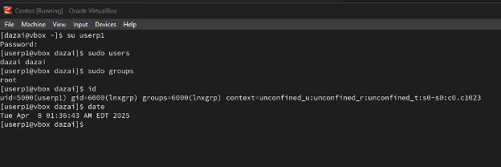
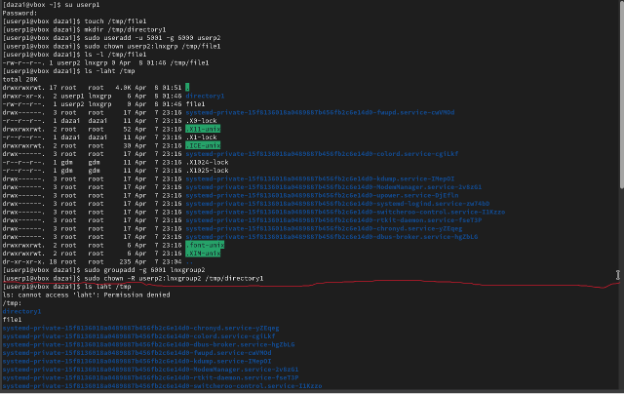
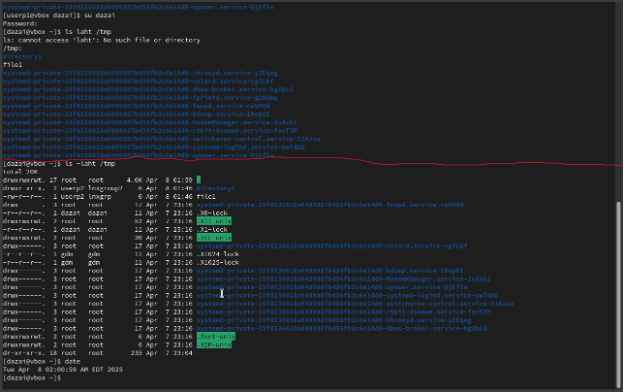
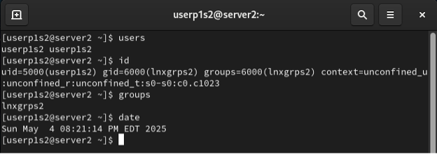
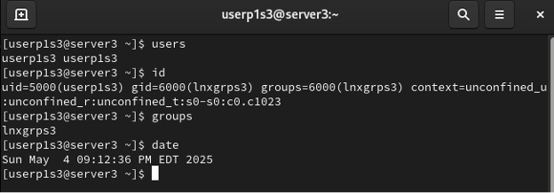
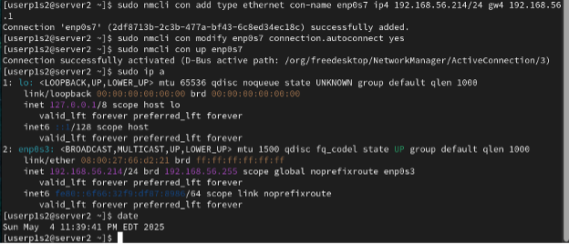
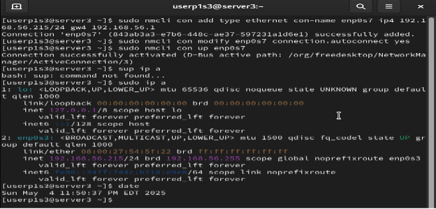
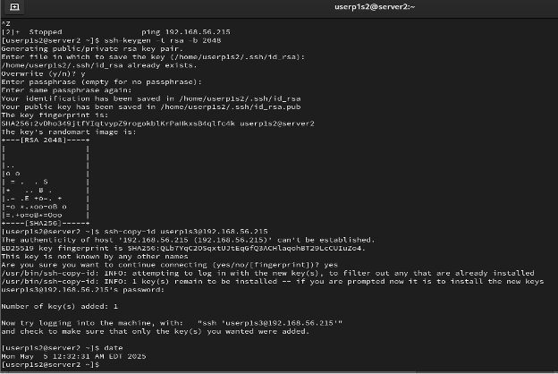
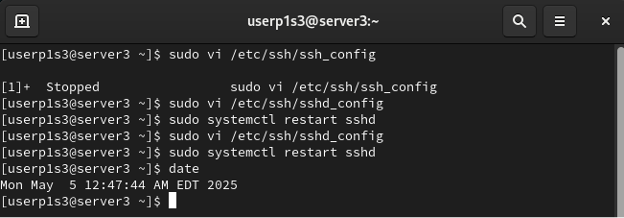
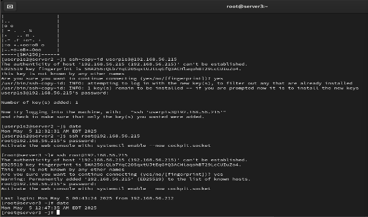

[Link to my github](https://github.com/DazaiHyena).

# Introduction

Featured in this portfolio are multiple lab projects. often times using different virtual machines or physical servers.

# Red Hat Linux System Administration

## Project 1: Using RedHat Linux to Configure a Network (Centos)

This project shows a step by step walkthrough of how to configure a network using RedHat Linux. SOME SECURITY PROTOCOLS HAVE BEEN IGNORED FOR THE SAKE OF DEMONSTRATION. 

Part One: Users and Groups for Server 1

1.	sudo groupadd -g 6000 lnxgroup (creates group)
getent group lnxgroup (verifies lnxgroup)

2.	sudo useradd -u 6000 userp1 (creates userp1)
id userp1 (verifies userp1)

3.	sudo passwd userp1 (creates password for userp1)
sudo chage -m 4 -M 30 -W 10 userp1 (minimum and maximum password life)
sudo chage -E 2026-12-20 userp1 (account expiration)
sudo chage -l userp1 (lists details)

4.	sudo visudo -f /etc/sudoers.d/userp1 (opens sudoer file)
user1 ALL=(ALL) NOPASSWD: ALL (paste this in sudoer file)
su userp1 (switches to userp1)
sudo whoami (verifies root privileges, should list “root”)

5. sudo users (does not ask for password)
    sudo groups (does not ask for password)
    id (displays id, gid, and group info for userp1)



Part Two: Users and Groups for Server 2

1.	su userp1 (switches to userp1)
touch /tmp/file1 (creates file)
mkdir /tmp/directory1 (creates directory)

2.	sudo useradd -u 5001 -g 6000 userp2 (creates userp2)
sudo chown userp2:lnxgrp /tmp/file1 (changes ownership of file)
ls -l /tmp/file1 (verifies ownership)

3.	ls -laht/tmp (lists tmp content)


4.	sudo groupadd -g 6001 lnxgroup2 (creates new group)
sudo chown -R userp2:lnxgroup2 /tmp/directory1 (changes ownership of directory 1 recursively)

5.	ls -laht /tmp (lists tmp contents)
date (displays date)

I had to include two screenshots, I made a mistake with my commands that resulted in multiple errors, I put a red line where the errors begin and end.




Part 3: Servers and Groups for Server 2
6.	sudo groupadd -g 6000 lnxgrps2
(creates group)

7.	sudo useradd -u 5000 -g 6000 userp1s2
(creates user)

9.	echo ‘userp1s2:password’ | sudo chpasswd (sets password)
sudo chage -m 4 -M 30 -W 10 -E $(date -d  “Dec 20 next year” +%Y-%m-%d) userp1s2 (sets aging)

11.	echo ‘userp1s2 ALL=(ALL) NOPASSWD: ALL’ | sudo tee /etc/sudoers.d/userp1s2
sudo chmod 440 /etc/sudoers.d/userp1s2
	(adds userp1s2 to sudoers list)

13. su – userp1s2 *switches from my standard account to userp1s2*
    users (lists users)
	id (further confirms user and group information)
    groups 
    date





Part Three: Users and Groups for Server 3

14.	sudo groupadd -g 6000 lnxgrps 3

15.	sudo useradd -u 5000 -g 6000 userp1s3 

16.	echo ‘userp1s3:password’ | sudo chpasswd
sudo chage -m 4 -M 30 -W 10 -E $(date -d “Dec 20 next year” +%Y-%m-%d) userp1s3 

17.	echo 'userp1s3 ALL=(ALL) NOPASSWD: ALL' | sudo tee /etc/sudoers.d/userp1s3
sudo chmod 440 /etc/sudoers.d/userp1s3

18. su - userp1s3
    users
	id
	groups
    date



Part Four: Networking Config for Server 2

 19. sudo ip a
 	 (no matter how many times I tried, it wouldn’t list enp0s7 as a connection type, although later I was able to verify the state as “up”)

 20. sudo nmcli con add type ethernet con-name enp0s7 ip4 192.168.56.214/24 gw4 192.168.56.1
	 (Configures the IP)

 21. sudo nmcli con modify enp0s7 connection.autoconnect yes
	 (enables autoconnect on boot)
	 sudo nmcli con up enp0s7 (changes enp0s7 state to up)
	 date




Part Five: Network Config for Server 3

 22. sudo ip a

 23. sudo nmcli con add type ethernet con-name enp0s7 ip4 192.168.56.215/24 gw4 192.168.56.1

 24. sudo nmcli con modify enp0s7 connection.autoconnect yes
	 sudo nmcli con up enp0s7 
	 date




Part Six: Configuring SSH

 25. ssh-keygen -t rsa -b 2048
	 (creates the ssh key)

 26. ssh-copy-id userp1s3@192.168.56.215
	 (copies ssh key to server3)

 27. ssh userp1s3@192.168.56.215 
	 (establishes ssh connection from server 2 to server 3)

 28. (For whatever reason every time I logged into server 3, it asked for a password, but it still worked)



 29. sudo vi /etc/ssh/sshd_config
	 (changed PermitRootLogin to no)

 31. sudo systemctl restart sshd
	 (restarts the ssh connection)

 32. ssh root@192.168.56.215
	 (executed this on server 2, it still allowed me to log in for some reason, perhaps I needed to reboot ssh for the change to take  			 effect)

 33. sudo vi /etc/ssh/sshd_config
	 sudo systemctl restart sshd
	 (reversed the change and server2 allowed me to login still)




*Above is the commands done server 3 below is the commands done on server 2*




# Cloud Projects

## Project 1: Using AWS to Connect to a Windows Instance With Remote Desktop 

This project is a step by step walkthrough of how to create a secure windows instance on AWS and connect to it from any other machine using Remote Desktop.


 1. Create Amazon EC2 instance using a Windows AMI.


 
 3. Select the instance type and either generate a new pem key pair or use an existing key pair.
    

 
 5. Either add an existing firewall security group or create one.
 
 6. Ensure RDP traffic is allowed from anywhere, you can change this if you would like to further restrict who can access       this server.


 
 7. Launch the instance.
 
 8. When the success banner appears, click the instance link.


 9. Highlight the checkbox for the windows instance, select the ACTIONS drop-down, under SECURITY select GET WINDOWS      PASSWORD


 10. Record IP, username, and password.


 11. Open Remote Desktop on any windows machine that you choose, this can be your host machine too


 12. Copy the public DNS to use as the computer name for remote desktop.


 13. Log into Remote Desktop as Administrator using the credentials mentioned previously.


 14. Remote Desktop window will appear.


## Project 2: Creating a Network File System in AWS

 1. Open an Amazon EC2 instance


 2. Name instance and choose Ubuntu version


 3. Select instance type and key pair, make sure to download key to host machine if needed


 4. Select security group


 5. Launch Instance, open Powershell and input this command ssh -i ~/Downloads/Project2WindowsKey.pem ubuntu@18.234.161.136 replace the file path with the file path to your private key and replace the ip address with the public ip address of your ubuntu server.


 6. This is the result of creating my EFS instance and mounting it to my EC2 instance. I used the command sudo mount -t nfs4 -o nfsvers=4.1,rsize=1048576,wsize=1048576,hard,timeo=600,retrans=2,noresvport fs-033372b6e38a55b4b.efs.us-east-1.amazonaws.com:/ efs to mount EFS to EC2. I used df -T -h to list the available disk free space in the file system. At the bottom of the list, the EFS instance is shown.


 7. I used dd if=/dev/zero of=~/efs/testfile bs=1M count=1024 to run a test file to the efs , and then used ls -lh ~/efs/testfile to verify the test file’s existence.


## Header 3

```js
// Javascript code with syntax highlighting.
var fun = function lang(l) {
  dateformat.i18n = require('./lang/' + l)
  return true;
}
```

```ruby
# Ruby code with syntax highlighting
GitHubPages::Dependencies.gems.each do |gem, version|
  s.add_dependency(gem, "= #{version}")
end
```

## Header 4

*   This is an unordered list following a header.
*   This is an unordered list following a header.
*   This is an unordered list following a header.

## Header 5

1.  This is an ordered list following a header.
2.  This is an ordered list following a header.
3.  This is an ordered list following a header.

## Header 6

| head1        | head two          | three |
|:-------------|:------------------|:------|
| ok           | good swedish fish | nice  |
| out of stock | good and plenty   | nice  |
| ok           | good `oreos`      | hmm   |
| ok           | good `zoute` drop | yumm  |

### There's a horizontal rule below this.

* * *

## Here is an unordered list:

*   Item foo
*   Item bar
*   Item baz
*   Item zip

### And an ordered list:

1.  Item one
1.  Item two
1.  Item three
1.  Item four

### And a nested list:

- level 1 item
  - level 2 item
  - level 2 item
    - level 3 item
    - level 3 item
- level 1 item
  - level 2 item
  - level 2 item
  - level 2 item
- level 1 item
  - level 2 item
  - level 2 item
- level 1 item

### Small image


### Large image


### Definition lists can be used with HTML syntax.

<dl>
<dt>Name</dt>
<dd>Godzilla</dd>
<dt>Born</dt>
<dd>1952</dd>
<dt>Birthplace</dt>
<dd>Japan</dd>
<dt>Color</dt>
<dd>Green</dd>
</dl>

```
Long, single-line code blocks should not wrap. They should horizontally scroll if they are too long. This line should be long enough to demonstrate this.
```

```
The final element.
```
