[Link to my github](https://github.com/DazaiHyena).

# Introduction

Featured in this portfolio are multiple lab projects. often times using different virtual machines or physical servers.

# Cloud Projects

## Project 1: Using AWS to Connect to a Windows Instance With Remote Desktop 

This project is a step by step walkthrough of how to create a secure windows instance on AWS and connect to it from any other machine using Remote Desktop.


 1. Create Amazon EC2 instance using a Windows AMI.

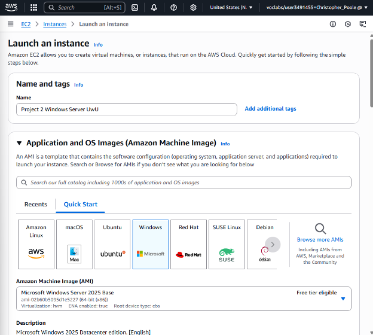
 
 3. Select the instance type and either generate a new pem key pair or use an existing key pair.
    
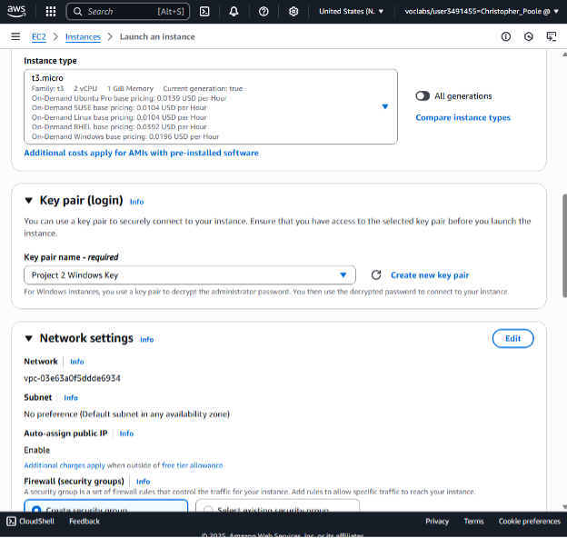
 
 5. Either add an existing firewall security group or create one.
 
 6. Ensure RDP traffic is allowed from anywhere, you can change this if you would like to further restrict who can access       this server.


 
 7. Launch the instance.
 
 8. When the success banner appears, click the instance link.

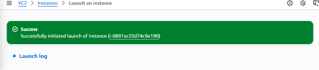

 9. Highlight the checkbox for the windows instance, select the ACTIONS drop-down, under SECURITY select GET WINDOWS      PASSWORD


 10. Record IP, username, and password.

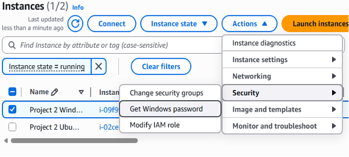

 11. Open Remote Desktop on any windows machine that you choose, this can be your host machine too

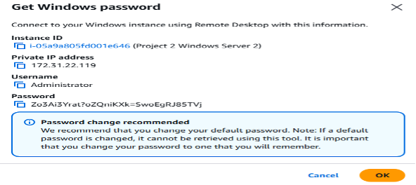

 12. Copy the public DNS to use as the computer name for remote desktop.

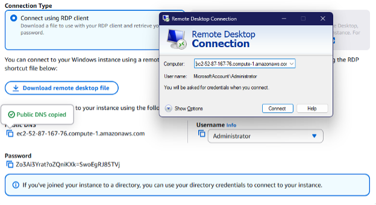

 13. Log into Remote Desktop as Administrator using the credentials mentioned previously.

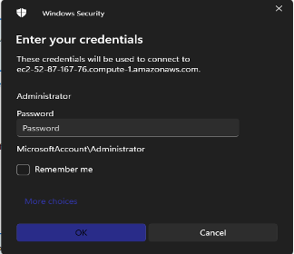

 14. Remote Desktop window will appear.

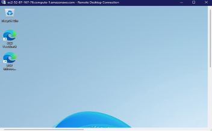


## Project 2: Creating a Network File System in AWS

 1. Open an Amazon EC2 instance

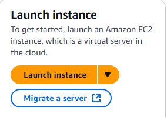

 2. Name instance and choose Ubuntu version

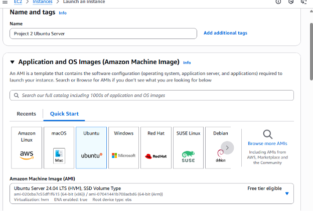

 3. Select instance type and key pair, make sure to download key to host machine if needed

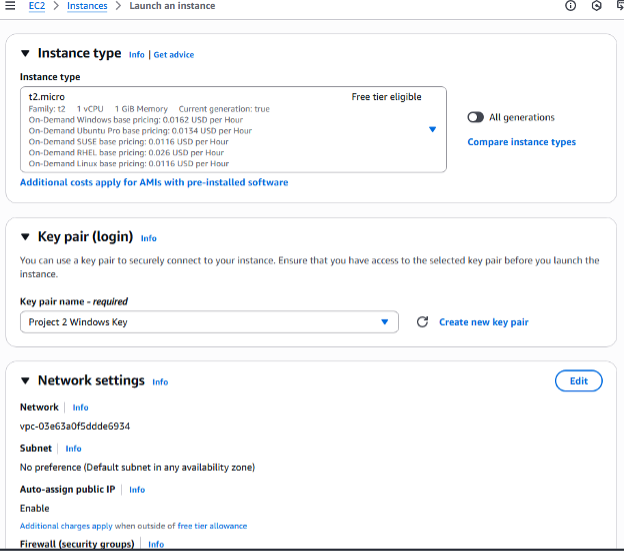

 4. Select security group

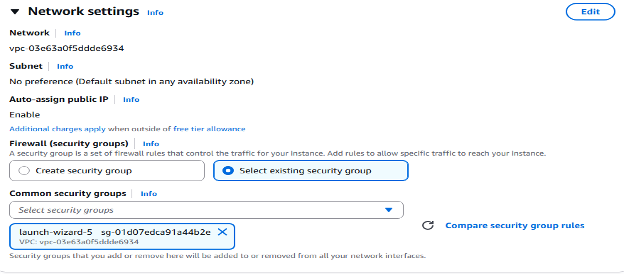

 5. Launch Instance, open Powershell and input this command ssh -i ~/Downloads/Project2WindowsKey.pem ubuntu@18.234.161.136 replace the file path with the file path to your private key and replace the ip address with the public ip address of your ubuntu server.

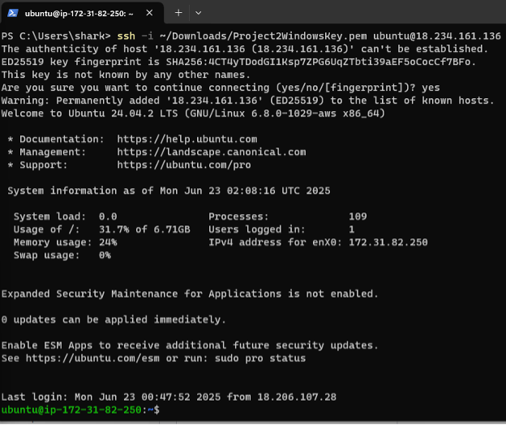

 6. This is the result of creating my EFS instance and mounting it to my EC2 instance. I used the command sudo mount -t nfs4 -o nfsvers=4.1,rsize=1048576,wsize=1048576,hard,timeo=600,retrans=2,noresvport fs-033372b6e38a55b4b.efs.us-east-1.amazonaws.com:/ efs to mount EFS to EC2. I used df -T -h to list the available disk free space in the file system. At the bottom of the list, the EFS instance is shown.

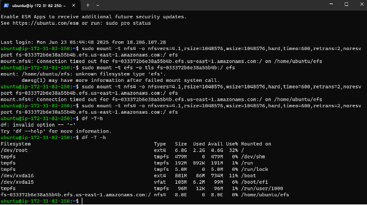

 7. I used dd if=/dev/zero of=~/efs/testfile bs=1M count=1024 to run a test file to the efs , and then used ls -lh ~/efs/testfile to verify the test file’s existence.

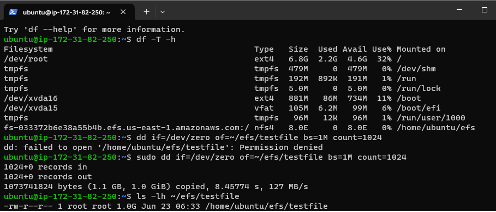


## Header 3

```js
// Javascript code with syntax highlighting.
var fun = function lang(l) {
  dateformat.i18n = require('./lang/' + l)
  return true;
}
```

```ruby
# Ruby code with syntax highlighting
GitHubPages::Dependencies.gems.each do |gem, version|
  s.add_dependency(gem, "= #{version}")
end
```

## Header 4

*   This is an unordered list following a header.
*   This is an unordered list following a header.
*   This is an unordered list following a header.

## Header 5

1.  This is an ordered list following a header.
2.  This is an ordered list following a header.
3.  This is an ordered list following a header.

## Header 6

| head1        | head two          | three |
|:-------------|:------------------|:------|
| ok           | good swedish fish | nice  |
| out of stock | good and plenty   | nice  |
| ok           | good `oreos`      | hmm   |
| ok           | good `zoute` drop | yumm  |

### There's a horizontal rule below this.

* * *

## Here is an unordered list:

*   Item foo
*   Item bar
*   Item baz
*   Item zip

### And an ordered list:

1.  Item one
1.  Item two
1.  Item three
1.  Item four

### And a nested list:

- level 1 item
  - level 2 item
  - level 2 item
    - level 3 item
    - level 3 item
- level 1 item
  - level 2 item
  - level 2 item
  - level 2 item
- level 1 item
  - level 2 item
  - level 2 item
- level 1 item

### Small image


### Large image


### Definition lists can be used with HTML syntax.

<dl>
<dt>Name</dt>
<dd>Godzilla</dd>
<dt>Born</dt>
<dd>1952</dd>
<dt>Birthplace</dt>
<dd>Japan</dd>
<dt>Color</dt>
<dd>Green</dd>
</dl>

```
Long, single-line code blocks should not wrap. They should horizontally scroll if they are too long. This line should be long enough to demonstrate this.
```

```
The final element.
```
